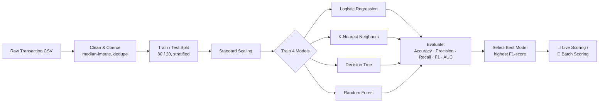

<div align="center">

# 🛡️ Aegis — Credit Card Fraud Intelligence

**A real-time, ML-powered fraud detection dashboard built with Streamlit, scikit-learn & Plotly**

[](https://www.python.org/)
[](https://streamlit.io/)
[](https://scikit-learn.org/)
[](https://plotly.com/)
[](LICENSE)

</div>

---

## 📌 Overview

**Aegis** is an end-to-end fraud detection system packaged as an interactive Streamlit application. It trains and compares four classification models on transaction-level behavioral data, then exposes the best-performing model through three interactive workflows: a data-exploration dashboard, a single-transaction "live" fraud check, and a batch CSV scoring tool.

The app is built around a **glassmorphism-styled dark UI** with custom CSS, animated gauge charts, and Plotly visualizations themed to match — designed to look and feel like a real fraud-ops product rather than a bare-bones model demo.

> 🎥 *Add a screenshot or screen recording of the Overview page here once deployed, e.g.:*
> 

---

## ✨ Key Features

| Page | What it does |
|---|---|
| 🏠 **Overview** | KPI cards (total transactions, fraud count, amount at risk, model accuracy), class-balance donut chart, transaction-amount distribution, and a full feature-correlation heatmap |
| 📊 **Data Explorer** | Interactive feature-distribution histograms, feature-vs-fraud-risk scatter plots, and a styled statistical summary table |
| 🤖 **Model Performance** | Side-by-side comparison of Accuracy, Precision, Recall, F1, and AUC across all four models, plus per-model confusion matrix and ROC curve |
| 🔮 **Live Fraud Check** | Slider-driven form to score a single synthetic transaction in real time, with a fraud-probability gauge and a verdict card |
| 📁 **Batch Prediction** | Upload a CSV of transactions to score in bulk, with summary KPIs and a downloadable results file |

---

## 🧠 Machine Learning Pipeline



### Models compared
- **Logistic Regression** (`class_weight='balanced'`)
- **K-Nearest Neighbors** (`k=5`)
- **Decision Tree** (`class_weight='balanced'`)
- **Random Forest** (200 trees, `class_weight='balanced'`)

The model with the highest **F1-score** on the held-out test set is automatically selected as the default scoring engine across the app.

### Features used for scoring
```
Time, Transaction_Amount_Ratio, Transaction_Frequency, Merchant_Risk_Score,
Customer_Risk_Score, Account_Age_Months, Device_Trust_Score, Location_Risk_Score,
Transaction_Velocity, Cardholder_Behavior_Score, Fraud_Risk_Index, Amount
```

---

## 📂 Project Structure

```
.
├── creditcard_app.py         # Main Streamlit application
├── creditcard_data.csv       # Transaction dataset (Time, 12 features, Class)
├── requirements.txt          # Python dependencies
└── README.md
```

---

## 🚀 Getting Started

### 1. Clone the repo
```bash
git clone https://github.com/<your-username>/<your-repo>.git
cd <your-repo>
```

### 2. Install dependencies
```bash
pip install -r requirements.txt
```

<details>
<summary><code>requirements.txt</code> (click to expand)</summary>

```
streamlit
pandas
numpy
plotly
scikit-learn
```
</details>

### 3. Add your dataset
Place a `creditcard_data.csv` file in the project root containing the 12 feature columns listed above plus a binary `Class` column (`1` = fraud, `0` = genuine).

### 4. Run the app
```bash
streamlit run creditcard_app.py
```

The app will open at `http://localhost:8501`.

---


## 🛠️ Tech Stack

- **Frontend / App framework:** Streamlit, custom CSS (glassmorphism / dark theme)
- **Modeling:** scikit-learn (Logistic Regression, KNN, Decision Tree, Random Forest)
- **Visualization:** Plotly Express & Plotly Graph Objects
- **Data handling:** pandas, NumPy

---

## 🗺️ Roadmap Ideas

- [ ] Persist trained models to disk (`joblib`) instead of retraining on every session
- [ ] Add SHAP-based explainability for individual predictions
- [ ] Support model retraining from an uploaded labeled dataset
- [ ] Add authentication for a production-style deployment

